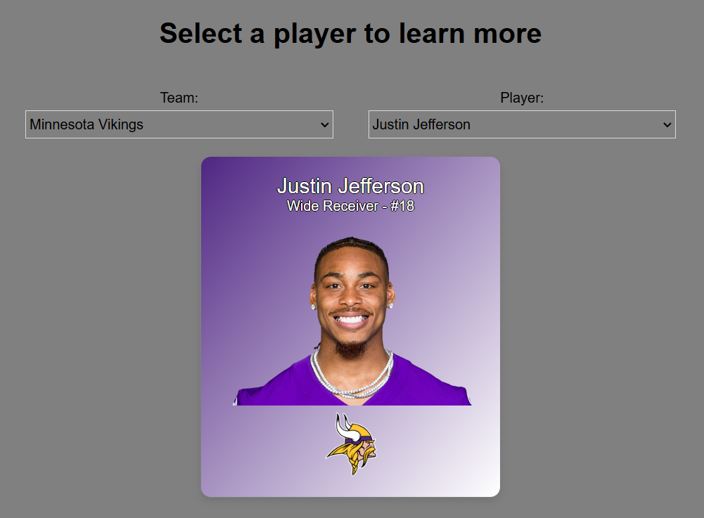

Project for testing and playing around with APIs using this resource: https://gist.github.com/nntrn/ee26cb2a0716de0947a0a4e9a157bc1c

To run the project locally, clone the repository to your desired directory. Then run the following commands:
```
npm install
npm start
```

Available functions:
- Player selector


Ideas for developing further:
- Statistics display
- Prop bet analyzer